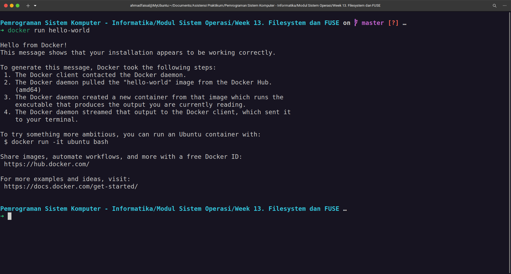

# Install Docker di Ubuntu 22.04

Dalam modul ini, instalasi Docker dilakukan melalui Package Manager APT.

## Menghindari Konflik Package

Untuk menghindari hal ini, uninstall beberapa package berikut agar instalasi Docker dapat berjalan dengan aman tanpa konflik:

```bash
for pkg in docker.io docker-doc docker-compose podman-docker containerd runc; do sudo apt-get remove $pkg; done
```

## Menyiapkan Repositori

1. Update package `apt` dan install beberapa package berikut agar bisa menggunakan repository dengan protokol HTTPS:

    ```bash
    sudo apt-get update
    sudo apt-get install ca-certificates curl gnupg
    ```

2. Tambahkan kunci GPG resmi dari Docker:

    ```bash
    sudo install -m 0755 -d /etc/apt/keyrings
    curl -fsSL https://download.docker.com/linux/ubuntu/gpg | sudo gpg --dearmor -o /etc/apt/keyrings/docker.gpg
    sudo chmod a+r /etc/apt/keyrings/docker.gpg
    ```

3. Jalankan command di bawah ini untuk memilih repository Docker yang stabil.

    ```bash
    echo \
    "deb [arch="$(dpkg --print-architecture)" signed-by=/etc/apt/keyrings/docker.gpg] https://download.docker.com/linux/ubuntu \
    "$(. /etc/os-release && echo "$VERSION_CODENAME")" stable" | \
    sudo tee /etc/apt/sources.list.d/docker.list > /dev/null
    ```

## Install Docker Engine

1. Update ulang package `apt`:

    ```bash
    sudo apt-get update
    ```

2. Install Docker Engine, containerd, dan Docker Compose:

    ```bash
    sudo apt-get install docker-ce docker-ce-cli containerd.io docker-buildx-plugin docker-compose-plugin
    ```

3. Pastikan bahwa Docker Engine telah berhasil terinstall dengan cara menjalankan image `hello-world`.

    ```bash
    sudo docker run hello-world
    ```

    

## Konfigurasi Tambahan

Konfigurasi tambahan ini dilakukan agar Docker bisa dijalankan oleh user non-root dan tanpa privilege `sudo` (perhatikan bahwa pada perintah di bab sebelumnya, docker dijalankan menggunakan `sudo` agar bisa dieksekusi). Caranya adalah dengan membuat grup baru bernama `docker`, kemudian memasukkan user yang ingin menjalankan Docker ke grup tersebut. Langkah-langkahnya adalah sebagai berikut:

1. Buat grup baru bernama `docker`:

    ```bash
    sudo groupadd docker
    ```

2. Tambahkan user ke grup `docker`:

    ```bash
    sudo usermod -aG docker $USER
    ```

3. Aktifkan perubahan konfigurasi grup:

    ```bash
    newgrp docker
    ```

4. Pastikan bahwa `docker` sudah bisa dijalankan tanpa `sudo`:

    ```bash
    docker run hello-world
    ```

    
    
## Sumber Referensi

* https://docs.docker.com/engine/install/ubuntu/
* https://docs.docker.com/engine/install/linux-postinstall/


